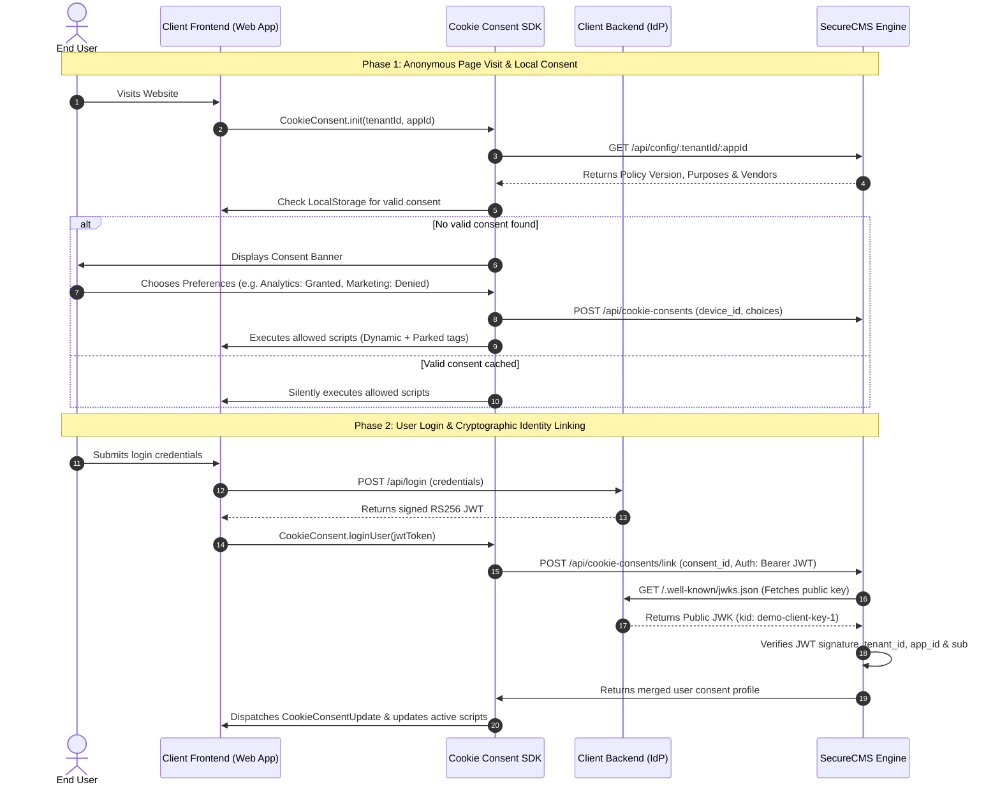

# Secure CMS Cookie Consent SDK — Client Integration Guide

This guide provides exhaustive technical documentation for clients integrating the **Secure CMS Cookie Consent System** into their web applications. It covers frontend setup, client backend authentication (RS256 JWT & JWKS), script governance strategies, complete API references, and regulatory compliance patterns.

---

## 📑 Table of Contents

1. [Architecture & System Flow](#1-architecture--system-flow)
2. [Prerequisites & Configuration](#2-prerequisites--configuration)
3. [Client Backend Authentication (JWT & JWKS)](#3-client-backend-authentication-jwt--jwks)
   - [Why RS256 Asymmetric Signing?](#why-rs256-asymmetric-signing)
   - [Required JWT Claims](#required-jwt-claims)
   - [Required Backend Endpoints](#required-backend-endpoints)
   - [Complete Reference Backend Server (Node.js)](#complete-reference-backend-server-nodejs)
   - [Alternative Framework Implementations](#alternative-framework-implementations)
4. [Frontend SDK Integration](#4-frontend-sdk-integration)
   - [Step 1: Include SDK Assets](#step-1-include-sdk-assets)
   - [Step 2: Initialize on Page Load](#step-2-initialize-on-page-load)
   - [Step 3: Handle User Login & Cross-Device Sync](#step-3-handle-user-login--cross-device-sync)
   - [Step 4: Handle User Logout](#step-4-handle-user-logout)
   - [Step 5: Provide a "Cookie Preferences" Trigger](#step-5-provide-a-cookie-preferences-trigger)
   - [Step 6: Listen for Consent Events (Webhook)](#step-6-listen-for-consent-events-webhook)
5. [Modern Framework Integration Examples](#5-modern-framework-integration-examples)
   - [React / Next.js Integration](#react--nextjs-integration)
   - [Vue 3 / Nuxt Integration](#vue-3--nuxt-integration)
   - [Angular Integration](#angular-integration)
6. [Script Blocking & Governance Strategies](#6-script-blocking--governance-strategies)
   - [Strategy A: Tag-Based Blocking (In-line HTML)](#strategy-a-tag-based-blocking-in-line-html)
   - [Strategy B: Dynamic Script Injection (Dashboard Managed)](#strategy-b-dynamic-script-injection-dashboard-managed)
7. [Complete SDK JavaScript API Reference](#7-complete-sdk-javascript-api-reference)
8. [SecureCMS Backend REST API Reference](#8-securecms-backend-rest-api-reference)
9. [DPDP Act 2023 Compliance Checklist](#9-dpdp-act-2023-compliance-checklist)
10. [Troubleshooting & FAQ](#10-troubleshooting--faq)

---

## 1. Architecture & System Flow

The Secure CMS ecosystem coordinates three independent components to manage user privacy:

1. **Client Web App (Frontend)**: Loads the lightweight Cookie Consent SDK, presents compliance banners to users, and manages conditional script execution.
2. **Client Backend (Identity Provider / Auth Server)**: Authenticates your users and issues cryptographically signed **RS256 JWT** tokens while exposing a standard **JWKS (JSON Web Key Set)** endpoint.
3. **SecureCMS Consent Engine (`https://cookie-be.securedapp.io/api`)**: Stores tenant configurations, policy versions, script registries, and verifies signed user consents against your JWKS.



---

## 2. Prerequisites & Configuration

Before beginning integration, gather the following configuration parameters from your SecureCMS account administrator:

| Parameter | Description | Example Value |
| :--- | :--- | :--- |
| `tenantId` | Unique organization / tenant identifier | `"ICICI Bank"` or `"bank123"` |
| `appId` | Unique application identifier within your tenant | `"hdfc"` or `"web01"` |
| `SecureCMS API Base` | Production API endpoint of the SecureCMS backend | `https://cookie-be.securedapp.io/api` |
| `Client Base URL` | Public URL of your authentication/IdP server | `https://cookie-demo-be.securedapp.io` |

---

## 3. Client Backend Authentication (JWT & JWKS)

### Why RS256 Asymmetric Signing?

To synchronize consent across devices without security risks:
- **Zero Shared Secrets**: The client backend keeps its private RSA key strictly confidential.
- **Cryptographic Verification**: SecureCMS verifies tokens using the client's public JWK fetched from `/.well-known/jwks.json`.
- **Tamper-Proof Claims**: The user ID (`sub`), tenant, and app identifiers cannot be spoofed by malicious frontend clients.

---

### Required JWT Claims

When issuing a JWT for the Cookie Consent SDK, the token must be signed with **RS256** and contain the following payload structure:

```json
{
  "iss": "https://cookie-demo-be.securedapp.io",
  "aud": "hdfc",
  "sub": "user_123",
  "tenant_id": "ICICI Bank",
  "app_id": "hdfc",
  "name": "Jane Doe",
  "iat": 1724250000,
  "nbf": 1724250000,
  "exp": 1724253600
}
```

#### Claim Definitions:
- `iss` *(string, Required)*: The Issuer URL. Must match your backend's public base URL.
- `aud` *(string, Required)*: The Audience. Must match your `appId`.
- `sub` *(string, Required)*: The unique User ID in your database.
- `tenant_id` *(string, Required)*: Your assigned Tenant ID.
- `app_id` *(string, Required)*: Your assigned App ID.
- `exp` *(number, Required)*: Expiration UNIX timestamp (recommended: 1 hour).
- `iat` / `nbf` *(number, Required)*: Issued-at / Not-before UNIX timestamp.

#### JWT Header:
```json
{
  "alg": "RS256",
  "typ": "JWT",
  "kid": "demo-client-key-1"
}
```

---

### Required Backend Endpoints

Your backend must expose the following three endpoints:

1. `GET /.well-known/jwks.json`: Public endpoint serving your active RSA public keys.
2. `POST /api/login`: Authenticates the user and returns the signed RS256 JWT.
3. `GET /health`: Health check and discovery endpoint.

---

### Complete Reference Backend Server (Node.js)

Below is a complete, single-file reference implementation using standard Node.js `crypto` and `http` modules:

```javascript
/**
 * Reference Client Authentication & JWKS Server
 * Endpoints:
 *   GET  /.well-known/jwks.json
 *   POST /api/login
 *   GET  /health
 */

const http = require('http');
const crypto = require('crypto');

const PORT = process.env.CLIENT_PORT || 4099;
const BASE_URL = process.env.BASE_URL || 'https://cookie-demo-be.securedapp.io';

const KEY_ID = 'demo-client-key-1';
const ISSUER = BASE_URL;

// 1. Generate RSA 2048-bit Key Pair (In production, load from secure key vault / PEM file)
const { privateKey, publicKey } = crypto.generateKeyPairSync('rsa', {
  modulusLength: 2048,
  publicKeyEncoding: { type: 'spki', format: 'pem' },
  privateKeyEncoding: { type: 'pkcs8', format: 'pem' }
});

// Convert public key to JWK format
const exportedJwk = crypto.createPublicKey(publicKey).export({ format: 'jwk' });
const publicJwk = {
  ...exportedJwk,
  kid: KEY_ID,
  use: 'sig',
  alg: 'RS256'
};

// Helper: Base64URL Encoding
function base64UrlEncode(value) {
  return Buffer.from(value)
    .toString('base64')
    .replace(/=/g, '')
    .replace(/\+/g, '-')
    .replace(/\//g, '_');
}

// Helper: Sign RS256 JWT
function createSignedJwt(payload, audience = 'hdfc', tenantId = 'ICICI Bank', appId = 'hdfc') {
  const header = {
    alg: 'RS256',
    typ: 'JWT',
    kid: KEY_ID
  };

  const now = Math.floor(Date.now() / 1000);
  const fullPayload = {
    iss: ISSUER,
    aud: audience,
    sub: payload.userId,
    tenant_id: tenantId,
    app_id: appId,
    name: payload.name || payload.userId,
    iat: now,
    nbf: now,
    exp: now + 3600 // 1 hour validity
  };

  const headerB64 = base64UrlEncode(JSON.stringify(header));
  const payloadB64 = base64UrlEncode(JSON.stringify(fullPayload));
  const signatureInput = `${headerB64}.${payloadB64}`;

  const signer = crypto.createSign('RSA-SHA256');
  signer.update(signatureInput);
  signer.end();

  const signature = signer.sign(privateKey);
  const signatureB64 = signature
    .toString('base64')
    .replace(/=/g, '')
    .replace(/\+/g, '-')
    .replace(/\//g, '_');

  return `${signatureInput}.${signatureB64}`;
}

// HTTP Server
const server = http.createServer((req, res) => {
  // CORS configuration
  res.setHeader('Access-Control-Allow-Origin', '*');
  res.setHeader('Access-Control-Allow-Methods', 'GET, POST, OPTIONS');
  res.setHeader('Access-Control-Allow-Headers', 'Content-Type, Authorization');

  if (req.method === 'OPTIONS') {
    res.writeHead(204);
    res.end();
    return;
  }

  const url = new URL(req.url, BASE_URL);

  // 1. JWKS Endpoint
  if (req.method === 'GET' && url.pathname === '/.well-known/jwks.json') {
    res.writeHead(200, { 'Content-Type': 'application/json' });
    res.end(JSON.stringify({ keys: [publicJwk] }, null, 2));
    return;
  }

  // 2. User Login & Token Issuance
  if (req.method === 'POST' && url.pathname === '/api/login') {
    let body = '';
    req.on('data', chunk => { body += chunk; });
    req.on('end', () => {
      try {
        const data = JSON.parse(body || '{}');
        const userId = data.userId || 'user_123';
        const tenantId = data.tenantId || 'ICICI Bank';
        const appId = data.appId || 'hdfc';
        const audience = data.audience || appId;

        const token = createSignedJwt({ userId, name: data.name }, audience, tenantId, appId);

        res.writeHead(200, { 'Content-Type': 'application/json' });
        res.end(JSON.stringify({
          success: true,
          userId,
          tenantId,
          appId,
          token,
          issuer: ISSUER,
          jwks_url: `${ISSUER}/.well-known/jwks.json`,
          expires_in: 3600
        }, null, 2));
      } catch (err) {
        res.writeHead(400, { 'Content-Type': 'application/json' });
        res.end(JSON.stringify({ error: err.message }));
      }
    });
    return;
  }

  // 3. Health & Discovery
  if (url.pathname === '/' || url.pathname === '/health') {
    res.writeHead(200, { 'Content-Type': 'application/json' });
    res.end(JSON.stringify({
      status: 'online',
      service: 'Client Identity Provider (JWKS & Auth)',
      issuer: ISSUER,
      jwks_url: `${ISSUER}/.well-known/jwks.json`
    }, null, 2));
    return;
  }

  // 404 Fallback
  res.writeHead(404, { 'Content-Type': 'application/json' });
  res.end(JSON.stringify({ error: 'Endpoint not found' }));
});

server.listen(PORT, () => {
  console.log(`Demo Client IdP Server running on port ${PORT}`);
  console.log(`JWKS URL: ${BASE_URL}/.well-known/jwks.json`);
});
```

---

### Alternative Framework Implementations

If you are using existing Identity Providers or backends:
- **Auth0 / Okta / Keycloak**: Ensure your Custom Claims include `tenant_id` and `app_id`, with the Token Signing Algorithm set to `RS256`. Your public keys will automatically be available at `https://<your-domain>/.well-known/jwks.json`.
- **Python (PyJWT / FastAPI)**:
  ```python
  import jwt, time

  payload = {
      "iss": "https://auth.client.com",
      "aud": "hdfc",
      "sub": user_id,
      "tenant_id": "ICICI Bank",
      "app_id": "hdfc",
      "iat": int(time.time()),
      "exp": int(time.time()) + 3600
  }
  token = jwt.encode(payload, private_key_pem, algorithm="RS256", headers={"kid": "key-1"})
  ```

---

## 4. Frontend SDK Integration

### Step 1: Include SDK Assets

Include the SDK CSS stylesheet and JavaScript bundle in the `<head>` of your HTML page. Ensure it is placed **before** any analytics or third-party marketing tags:

```html
<!DOCTYPE html>
<html lang="en">
<head>
  <meta charset="UTF-8">
  <title>Your Web Application</title>

  <!-- 1. SecureCMS SDK CSS -->
  <link rel="stylesheet" href="/dist/cookie-consent-sdk.css">

  <!-- 2. SecureCMS SDK JS (Loads synchronously or defer) -->
  <script src="/dist/cookie-consent-sdk.iife.js"></script>
</head>
<body>
  ...
```

---

### Step 2: Initialize on Page Load

Initialize the SDK as soon as the DOM is ready using your assigned `tenantId` and `appId`:

```html
<script>
  document.addEventListener('DOMContentLoaded', () => {
    if (window.CookieConsent) {
      window.CookieConsent.init('ICICI Bank', 'hdfc');
    }
  });
</script>
```

#### What happens during `.init()`:
1. Fetches current policy rules, purpose list, and vendor scripts from `GET /api/config/:tenantId/:appId`.
2. Checks `localStorage` for an existing, unexpired consent record (`user_cookie_consent`).
3. If valid consent exists, automatically executes the authorized scripts without showing the banner.
4. If no consent or policy version has changed, renders the responsive consent banner.

---

### Step 3: Handle User Login & Cross-Device Sync

When a user logs into your website and your backend returns the signed RS256 JWT, pass the token to `window.CookieConsent.loginUser()`:

```javascript
async function onUserLoginSuccess(loginResponse) {
  const jwtToken = loginResponse.token; // From POST /api/login

  // Link anonymous device consent with authenticated user identity
  if (window.CookieConsent) {
    await window.CookieConsent.loginUser(jwtToken);
  }
}
```

> [!NOTE]
> The SDK accepts either:
> 1. A raw JWT string: `CookieConsent.loginUser("eyJhbGciOi...")` (SDK automatically parses `sub`).
> 2. An object: `CookieConsent.loginUser({ userId: 'user_123', token: 'eyJhbGci...' })`.
> 3. Separate arguments: `CookieConsent.loginUser('user_123', 'eyJhbGci...')`.

---

### Step 4: Handle User Logout

When the user logs out of your site, clear user-scoped consent cache to prevent cross-account consent leakage on shared computers:

```javascript
function onUserLogout() {
  if (window.CookieConsent) {
    window.CookieConsent.logoutUser();
  }
  // Proceed with application logout redirect...
}
```

---

### Step 5: Provide a "Cookie Preferences" Trigger

Under the DPDP Act 2023, users must be able to change or withdraw consent at any time. Place a button or link in your website footer:

```html
<footer>
  <a href="javascript:void(0)" onclick="window.CookieConsent.openPreferences()">
    Manage Cookie Preferences
  </a>
</footer>
```

---

### Step 6: Listen for Consent Events (Webhook)

The SDK dispatches a `CookieConsentUpdate` event on the `window` object whenever consent is saved, updated, or synced:

```javascript
window.addEventListener('CookieConsentUpdate', (event) => {
  const consentRecord = event.detail;

  if (consentRecord) {
    console.log('Active Consent ID:', consentRecord.consent_id);
    console.log('Policy Version:', consentRecord.policy_version);
    console.log('Purposes:', consentRecord.purposes);

    // Example: Enable custom in-app feature flags
    const analyticsGranted = consentRecord.purposes?.some(
      p => p.name === 'Analytics' && p.status === 'granted'
    );
    
    if (analyticsGranted) {
      // Trigger internal custom telemetry
    }
  } else {
    console.log('Consent state cleared.');
  }
});
```

---

## 5. Modern Framework Integration Examples

### React / Next.js Integration

Create a custom hook `useCookieConsent.js`:

```javascript
// hooks/useCookieConsent.js
import { useEffect, useCallback } from 'react';

export function useCookieConsent(tenantId, appId) {
  useEffect(() => {
    if (typeof window !== 'undefined' && window.CookieConsent) {
      window.CookieConsent.init(tenantId, appId);
    }
  }, [tenantId, appId]);

  const loginUser = useCallback((jwtToken) => {
    if (window.CookieConsent) {
      return window.CookieConsent.loginUser(jwtToken);
    }
  }, []);

  const logoutUser = useCallback(() => {
    if (window.CookieConsent) {
      window.CookieConsent.logoutUser();
    }
  }, []);

  const openPreferences = useCallback(() => {
    if (window.CookieConsent) {
      window.CookieConsent.openPreferences();
    }
  }, []);

  return { loginUser, logoutUser, openPreferences };
}
```

#### Using in a Component:

```jsx
// components/Footer.jsx
import React from 'react';
import { useCookieConsent } from '../hooks/useCookieConsent';

export default function Footer() {
  const { openPreferences } = useCookieConsent('ICICI Bank', 'hdfc');

  return (
    <footer className="site-footer">
      <p>&copy; 2026 Your Organization</p>
      <button type="button" onClick={openPreferences}>
        Cookie Settings
      </button>
    </footer>
  );
}
```

---

### Vue 3 / Nuxt Integration

```vue
<!-- components/CookieManager.vue -->
<script setup>
import { onMounted } from 'vue';

const props = defineProps({
  tenantId: { type: String, required: true },
  appId: { type: String, required: true }
});

onMounted(() => {
  if (window.CookieConsent) {
    window.CookieConsent.init(props.tenantId, props.appId);
  }
});

const openSettings = () => {
  window.CookieConsent?.openPreferences();
};
</script>

<template>
  <button @click="openSettings" class="cookie-btn">
    Privacy Settings
  </button>
</template>
```

---

### Angular Integration

```typescript
// services/cookie-consent.service.ts
import { Injectable } from '@angular/core';

declare global {
  interface Window {
    CookieConsent: any;
  }
}

@Injectable({
  providedIn: 'root'
})
export class CookieConsentService {
  init(tenantId: string, appId: string) {
    if (window.CookieConsent) {
      window.CookieConsent.init(tenantId, appId);
    }
  }

  login(jwtToken: string) {
    return window.CookieConsent?.loginUser(jwtToken);
  }

  logout() {
    window.CookieConsent?.logoutUser();
  }

  openPreferences() {
    window.CookieConsent?.openPreferences();
  }
}
```

---

## 6. Script Blocking & Governance Strategies

To ensure strict zero-data leakage before consent is granted, the SDK provides two blocking methods:

### Strategy A: Tag-Based Blocking (In-line HTML)

Use this method for tracking pixels, inline analytics, or third-party tags placed directly in your HTML templates:

1. Set `type="text/plain"`.
2. Add the `data-cc-purpose` attribute matching the purpose name in SecureCMS (e.g., `analytics`, `marketing`).

#### Example: External Script
```html
<!-- Browser ignores this script completely on page load -->
<script 
  type="text/plain" 
  data-cc-purpose="analytics" 
  src="https://www.googletagmanager.com/gtag/js?id=G-XXXXX">
</script>
```

#### Example: Inline Script
```html
<script type="text/plain" data-cc-purpose="marketing">
  !function(f,b,e,v,n,t,s)
  {/* Facebook Pixel Code */}
  fbq('init', '1234567890');
  fbq('track', 'PageView');
</script>
```

#### How Activation Works:
When the user grants consent for `analytics`:
1. The SDK queries the DOM for `script[type="text/plain"][data-cc-purpose="analytics"]`.
2. It generates a new `<script type="text/javascript">` node, clones all attributes, and replaces the parked tag.
3. The browser immediately executes the script.

---

### Strategy B: Dynamic Script Injection (Dashboard Managed)

If you configure third-party vendors and their script URLs in the SecureCMS Admin Dashboard:
1. You do not need to place `<script>` tags in your HTML.
2. The SDK fetches the vendor list during `.init()`.
3. When the user approves a purpose category, the SDK dynamically injects the vendor scripts into `document.head`.
4. The SDK uses an internal Set (`window._cc_executed_vendors`) to ensure scripts are never injected twice in a single session.

---

## 7. Complete SDK JavaScript API Reference

The global `window.CookieConsent` object exposes the following methods:

### `CookieConsent.init(tenantId, appId)`
Initializes the SDK, fetches tenant policy configurations, checks cached consent validity, and presents the banner if required.
- **Parameters**:
  - `tenantId` *(string, Required)*: Organization identifier.
  - `appId` *(string, Required)*: Application identifier.
- **Returns**: `Promise<void>`

---

### `CookieConsent.openPreferences()`
Re-opens the "Manage Preferences" modal to allow users to update their consent choices.
- **Parameters**: None
- **Returns**: `void`

---

### `CookieConsent.loginUser(userTokenOrId, maybeToken)`
Links the anonymous device session to an authenticated user account and synchronizes cross-device consent preferences.
- **Parameters**:
  - `userTokenOrId` *(string | object, Required)*: RS256 JWT string, or `{ userId, token }`, or `userId` string.
  - `maybeToken` *(string, Optional)*: JWT string if first parameter was `userId`.
- **Returns**: `Promise<void>`

---

### `CookieConsent.logoutUser()`
Clears user-scoped consent records from `localStorage` and resets the banner for anonymous users.
- **Parameters**: None
- **Returns**: `void`

---

### Local Storage Schema

The SDK maintains the following keys in `localStorage`:

| Key | Description | Structure |
| :--- | :--- | :--- |
| `user_cookie_consent` | Active local consent record | `{"consent_id": "...", "policy_version": "v1.0", "purposes": [...], "expiry": "..."}` |
| `consent_device_id` | Unique anonymous device fingerprint | `"dev_abc123..."` |
| `consent_offline_queue` | Array of pending offline requests | `[{"payload": {...}, "method": "POST", "endpoint": "/cookie-consents"}]` |

---

## 8. SecureCMS Backend REST API Reference

The SDK communicates with the SecureCMS Backend (`https://cookie-be.securedapp.io/api`). The endpoints are documented below for full visibility:

### 1. Fetch Application Policy Configuration
`GET /api/config/:tenantId/:appId`
- **Response `200 OK`**:
```json
{
  "tenant_id": "ICICI Bank",
  "app_id": "hdfc",
  "policy_version": "v1.0.0",
  "banner_title": "We Value Your Privacy",
  "banner_description": "We use cookies to enhance your experience...",
  "purposes": [
    {
      "purpose_id": "p_essential",
      "name": "Essential",
      "is_essential": true,
      "description": "Necessary for website functionality and security."
    },
    {
      "purpose_id": "p_analytics",
      "name": "Analytics",
      "is_essential": false,
      "description": "Helps us understand how visitors interact with our site.",
      "vendors": [
        {
          "vendor_id": "v_ga4",
          "name": "Google Analytics 4",
          "scripts": ["https://www.googletagmanager.com/gtag/js?id=G-XXXX"]
        }
      ]
    }
  ]
}
```

---

### 2. Save Device Consent Decision
`POST /api/cookie-consents`
- **Request Body**:
```json
{
  "tenant_id": "ICICI Bank",
  "app_id": "hdfc",
  "device_id": "dev_xyz890",
  "policy_version": "v1.0.0",
  "purposes": [
    { "name": "Essential", "status": "granted", "timestamp": "2026-08-21T16:50:00Z" },
    { "name": "Analytics", "status": "granted", "timestamp": "2026-08-21T16:50:00Z" },
    { "name": "Marketing", "status": "denied", "timestamp": "2026-08-21T16:50:00Z" }
  ]
}
```
- **Response `200 OK`**:
```json
{
  "consent_id": "csnt_987654321",
  "status": "recorded",
  "timestamp": "2026-08-21T16:50:01Z"
}
```

---

### 3. Link Consent with User JWT
`POST /api/cookie-consents/link`
- **Headers**:
  - `Content-Type: application/json`
  - `Authorization: Bearer <RS256_JWT_TOKEN>`
- **Request Body**:
```json
{
  "consent_id": "csnt_987654321",
  "user_id": "user_123",
  "device_id": "dev_xyz890",
  "tenant_id": "ICICI Bank",
  "app_id": "hdfc"
}
```
- **Response `200 OK`**:
```json
{
  "success": true,
  "linked_user_id": "user_123",
  "synced_purposes": [ ... ]
}
```

---

### 4. Fetch User Consent by ID
`GET /api/cookie-consents/user/:userId?tenant_id=ICICI%20Bank&app_id=hdfc`
- **Headers**: `Authorization: Bearer <RS256_JWT_TOKEN>`
- **Response `200 OK`**: Returns current active consent profile for the authenticated user.

---

## 9. DPDP Act 2023 Compliance Checklist

To ensure full compliance under the **Digital Personal Data Protection Act 2023 (India)** and international privacy regulations:

- [x] **Affirmative Action**: No pre-ticked checkboxes or implicit consents on non-essential cookies.
- [x] **Granular Purposes**: Users can accept or deny specific categories (Analytics, Personalization, Marketing) individually.
- [x] **Clear Notice**: Accessible privacy policy and itemized vendor lists with clear explanations.
- [x] **Simple Withdrawal**: Easy-to-access "Manage Preferences" button in the footer at all times.
- [x] **Tamper-Evident Audit Trail**: Every decision is timestamped and recorded with a unique `consent_id`.
- [x] **Consent Expiry**: Consents are automatically renewed periodically (default: 6 months or on policy update).

---

## 10. Troubleshooting & FAQ

### Q1: The consent banner is not displaying on page load.
- **Cause 1**: Valid consent already exists in `localStorage`. Open DevTools -> Application -> Local Storage, clear `user_cookie_consent`, and reload.
- **Cause 2**: Configuration fetch failed. Check the browser Console/Network tab for errors calling `GET /api/config/:tenantId/:appId`. Verify that your `tenantId` and `appId` are spelled correctly.

### Q2: Parked `<script>` tags are not executing after consent is granted.
- Ensure the `data-cc-purpose` attribute on the script tag matches **exactly** with the purpose name configured in the backend (case-sensitive, e.g., `analytics`).
- Check that `type="text/plain"` was used on the original script element.

### Q3: JWT link fails with `401 Unauthorized`.
- Verify that your Client Backend's public JWKS endpoint is accessible at `${BASE_URL}/.well-known/jwks.json`.
- Ensure the `kid` in your JWT header matches the `kid` in your JWKS response.
- Verify that the `aud` claim matches your `appId` and `iss` matches your backend's public domain.

### Q4: How does the SDK handle offline users?
- Choices made while offline are saved in `localStorage` immediately to maintain local UI behavior, and queued in `consent_offline_queue`.
- The queue is automatically processed once internet connectivity is restored.

---

*For further integration assistance or custom deployment questions, contact the SecuredApp engineering team.*
