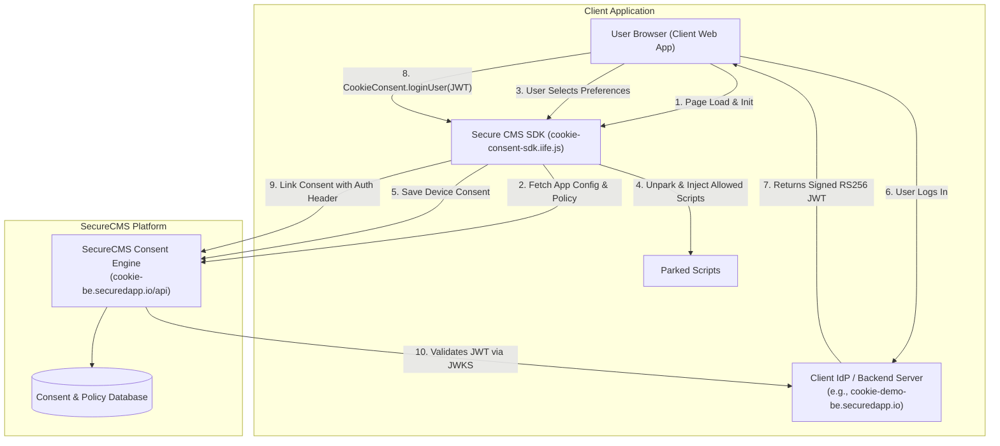

# Secure CMS Cookie Consent Management System & SDK

[](#compliance)
[](#license)
[](#jwt--jwks-architecture)

A high-performance, enterprise-grade, privacy-first **Cookie Consent Management System (CMS)** designed for strict regulatory compliance (including the **Digital Personal Data Protection (DPDP) Act 2023** and **GDPR**). 

The platform provides an end-to-end ecosystem: a dynamic consent policy backend, a lightweight zero-dependency frontend SDK, an offline-resilient sync engine, and a cryptographically verified **RS256 JWT & JWKS** identity linking flow across devices.

---

## 📑 Table of Contents

- [Overview & Architecture](#-overview--architecture)
- [Key Features](#-key-features)
- [Ecosystem Components](#-ecosystem-components)
- [How It Works](#-how-it-works)
  - [1. Script Blocking & Dynamic Injection](#1-script-blocking--dynamic-injection)
  - [2. Multi-Device Identity Sync via JWT & JWKS](#2-multi-device-identity-sync-via-jwt--jwks)
  - [3. Offline-First Resilience](#3-offline-first-resilience)
- [Quick Start Guide](#-quick-start-guide)
  - [Building the SDK](#1-building-the-sdk)
  - [Running the Client Auth Server](#2-running-the-client-auth-server)
  - [Testing with the Demo Website](#3-testing-with-the-demo-website)
- [Integration Documentation](#-integration-documentation)
- [Repository Structure](#-repository-structure)
- [Support & Contact](#-support--contact)

---

## 🌐 Overview & Architecture

Modern data protection laws mandate that **no non-essential tracking or marketing scripts may execute** before receiving explicit, granular consent from the user. Furthermore, consent preferences must seamlessly follow authenticated users across all their devices without exposing sensitive identity data.

Our architecture separates concerns across three primary components:



### Component Roles

| Component | Responsibility | Endpoints / Artifacts |
| :--- | :--- | :--- |
| **Frontend SDK** | Script execution governance, responsive UI banners, local storage management, offline queuing. | `sdk/dist/cookie-consent-sdk.iife.js`<br>`sdk/dist/cookie-consent-sdk.css` |
| **Client Backend (IdP)** | Issues signed RS256 JWT tokens upon user login and publishes public RSA keys over standard JWKS. | `POST /api/login`<br>`GET /.well-known/jwks.json` |
| **SecureCMS Backend** | Policy versioning, multi-tenant app configurations, consent audit storage, cryptographic JWT validation. | `https://cookie-be.securedapp.io/api` |

---

## ✨ Key Features

- 🛡️ **Zero-Data-Leak Script Blocking**:
  - **Tag-Based Blocking**: Prevents parked inline or external scripts (`<script type="text/plain" data-cc-purpose="...">`) from sending any network requests until explicitly authorized.
  - **Dynamic Injection**: Automatically fetches vendor script URLs from the central configuration and injects them only upon consent grant.
- 🔐 **Cryptographic User Identity Linking (RS256 JWT + JWKS)**:
  - Links anonymous device-level consent records to authenticated user accounts using industry-standard OpenID Connect (OIDC) patterns.
  - Prevents spoofing: SecureCMS verifies JWT signatures directly using the client's public JWKS endpoint.
- 🔄 **Cross-Device Consent Sync**:
  - When a user logs in on a new device or browser, their pre-existing consent preferences are automatically fetched and applied.
- 📴 **Offline-First Resilience**:
  - Stores consent choices in an offline queue during intermittent network failures and automatically synchronizes them upon reconnection.
- 🎨 **Modern, Accessible UI**:
  - Fully responsive banner and "Manage Preferences" modal with granular purpose toggles and clear vendor disclosures.
- 📜 **DPDP Act 2023 & GDPR Ready**:
  - Enforces policy versioning, audit trails, explicit affirmative actions, and simple consent withdrawal/updates.

---

## 🔍 How It Works

### 1. Script Blocking & Dynamic Injection

```
+-------------------------------------------------------------------------------+
| 1. Default (Blocked):                                                         |
|    <script type="text/plain" data-cc-purpose="analytics" src="ga.js"></script> |
|    --> Browser treats as raw text data. ZERO network requests made.           |
+-------------------------------------------------------------------------------+
                                    │
                         User Grants "Analytics"
                                    ▼
+-------------------------------------------------------------------------------+
| 2. Activated by SDK:                                                          |
|    SDK swaps type to "text/javascript" and replaces node in DOM.             |
|    --> Browser immediately fetches and executes ga.js.                        |
+-------------------------------------------------------------------------------+
```

### 2. Multi-Device Identity Sync via JWT & JWKS

1. The user logs into the client website.
2. The client backend generates an RS256-signed JWT containing the `sub` (User ID), `tenant_id`, and `app_id`.
3. The client frontend passes the JWT to the SDK via `window.CookieConsent.loginUser(jwtToken)`.
4. The SDK calls `POST /api/cookie-consents/link` on the SecureCMS backend, sending `Authorization: Bearer <jwtToken>`.
5. SecureCMS verifies the signature against the client's `/.well-known/jwks.json` endpoint and syncs preferences across all associated devices.

### 3. Offline-First Resilience

If a user confirms consent while offline:
1. The SDK saves choices locally in `localStorage` under `user_cookie_consent`.
2. The payload is queued in `localStorage` under `consent_offline_queue`.
3. A background task runs every 60 seconds (and upon network events) to flush queued requests to the backend.

---

## 🚀 Quick Start Guide

### 1. Building the SDK

To compile the latest SDK distribution files:

```bash
# Navigate to SDK directory
cd sdk

# Install dependencies
npm install

# Compile distribution bundle (IIFE + CSS)
npm run build   # or: npx vite build
```

This generates:
- `sdk/dist/cookie-consent-sdk.iife.js`
- `sdk/dist/cookie-consent-sdk.css`

### 2. Running the Client Auth Server

The client backend acts as your application's Identity Provider (IdP), providing the JWKS endpoint and issuing JWTs:

```bash
# Set environment variables (optional)
export CLIENT_PORT=4099
export BASE_URL="https://cookie-demo-be.securedapp.io"

# Start the server
node client-backend.js
```

**Live Endpoints**:
- Public JWKS: `GET https://cookie-demo-be.securedapp.io/.well-known/jwks.json`
- Login Endpoint: `POST https://cookie-demo-be.securedapp.io/api/login`
- Health Check: `GET https://cookie-demo-be.securedapp.io/health`

### 3. Testing with the Demo Website

The `demo-website/` directory contains a full reference portal demonstrating:
- Live banner & modal interactions.
- Dynamic script activation.
- JWT login & cross-device consent synchronization.
- Live audit console & SDK event listeners.

To test locally:
```bash
# Serve the demo website using any static server (e.g., Live Server or npx serve)
cd demo-website
npx serve .
```

---

## 📖 Integration Documentation

For complete, step-by-step instructions on integrating the SDK into your web applications, setting up your backend authentication server, and API specifications:

👉 **Read the comprehensive [Integration Guide (integration.md)](./integration.md)**

### Key Topics in `integration.md`:
- Detailed Frontend Setup (Vanilla JS, React, Next.js, Angular, Vue).
- Complete Client Backend Reference (Node.js, Python, Go, Java, ASP.NET).
- RS256 JWT Token Specifications & Claims.
- Complete SDK Javascript API Reference (`init`, `loginUser`, `logoutUser`, `openPreferences`).
- Webhook / Custom Events Reference (`CookieConsentUpdate`).
- SecureCMS REST APIs Reference.
- Best Practices for DPDP Act Compliance & Security.

---

## 📂 Repository Structure

```
cookie-sdk/
├── demo-website/                  # Full reference implementation & testing portal
│   ├── dist/                      # Pre-built SDK assets for demo
│   ├── index.html                 # Interactive banking demo with live audit console
│   └── privacy.html               # Reference privacy policy page
├── sdk/                           # Core Cookie Consent SDK source code
│   ├── dist/                      # Production build output (IIFE bundle & CSS)
│   ├── src/
│   │   ├── api.js                 # SecureCMS backend communication & offline queue
│   │   ├── consent.js             # Local storage handling, validity & expiry logic
│   │   ├── device.js              # Unique persistent device fingerprint generator
│   │   ├── scriptManager.js       # Dynamic script injection & tag-based unparking
│   │   ├── style.css              # Banner and preference modal styling
│   │   └── ui.js                  # Modal & banner DOM builder & state controller
│   ├── DEVELOPER_GUIDE.md         # Internal developer guide for script manager
│   ├── index.js                   # Public SDK entry point (window.CookieConsent)
│   ├── package.json               # Build scripts & dev dependencies
│   ├── README.md                  # SDK package readme
│   ├── README_CLIENT.md           # Client website quick start
│   └── vite.config.js             # Vite build configuration
├── integration.md                 # Full Client Integration Guide & API Reference
└── readme.md                      # Main repository overview & architecture guide
```

---

## 🔒 Security & Compliance

- **No Secret Sharing**: Authentication uses asymmetric cryptography (RS256). You never share your private key with SecureCMS.
- **Strict Audience Validation**: Each JWT token is locked to the specific `tenantId` and `appId`.
- **Granular Revocation**: Users can modify their consent preferences at any time via `CookieConsent.openPreferences()`.
- **Full Audit Logging**: Every consent decision is recorded with a unique `consent_id`, `policy_version`, timestamp, and device identifier.

---

## 📄 License

Proprietary and Confidential. Copyright &copy; 2026 SecuredApp. All rights reserved.
